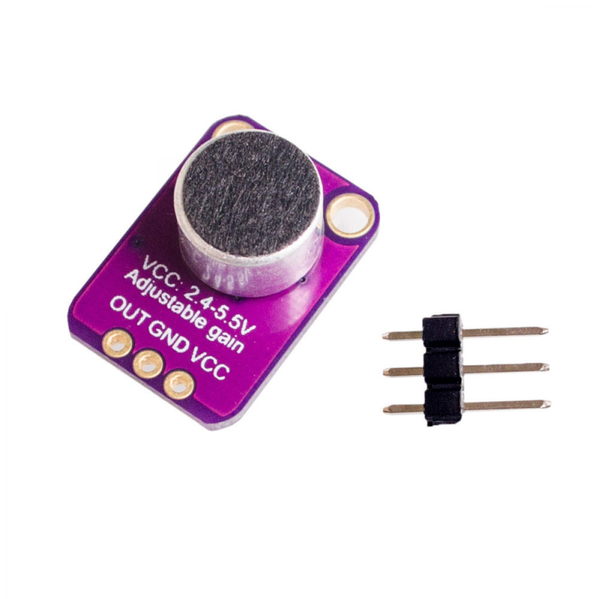

## SENSORS OVERVIEW

This is an overview of the sensors wich are going to be used throughout the installation, the sensors will be visible and give direct feedback to user.

**Light sensor**

A photosensitive resistor (LDR) to measure the amount of light. The resistance varies based on the amount of light the LDR receives.

**IR pyroelectric infrared motion sensor**

Used to detect people/animals based on their heat radiation (infra-red).

**DHT11 Thermometer Temperature and Humidity Sensor**

Temperature and humidity sensor.

**Membrane Pressure sensorr**

This sensor is capable of measuring pressure by means of the membranes processed in the sensor.  
The resistance of the sensor changes based on the pressure on the membrane.

**MAX4466 Microphone Amplifier Module with Microphone**

Ambient sound measuring microphone.
